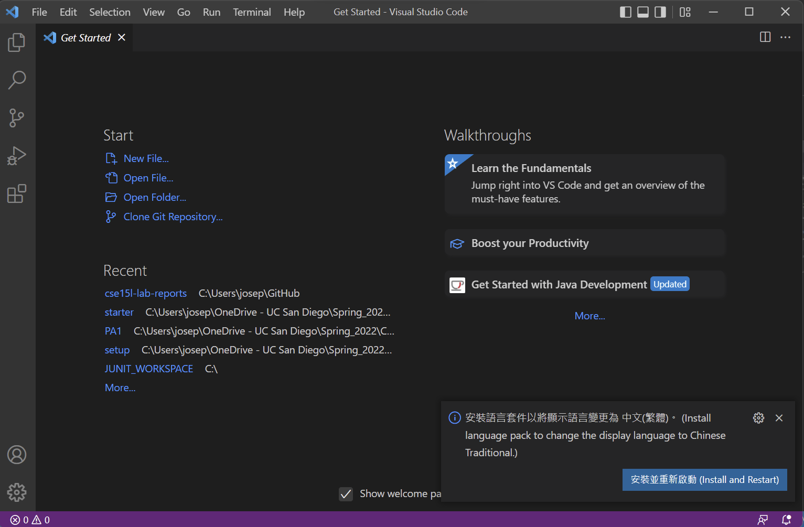
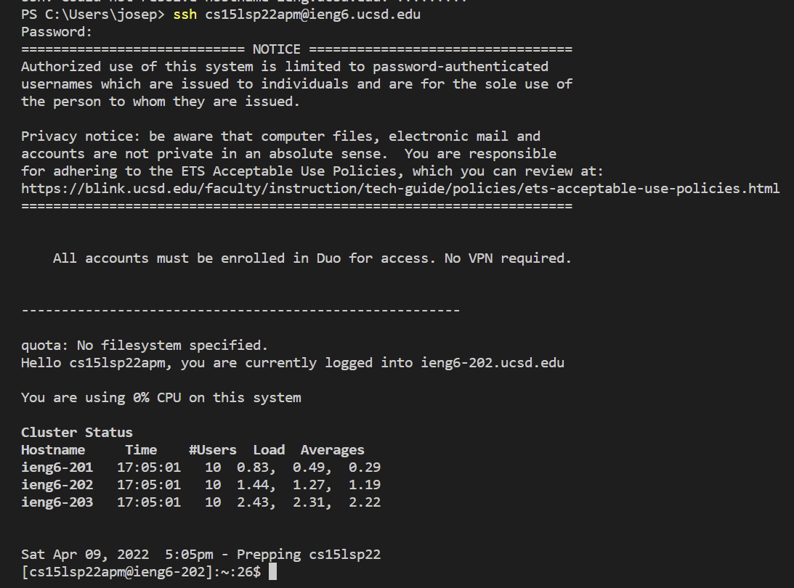
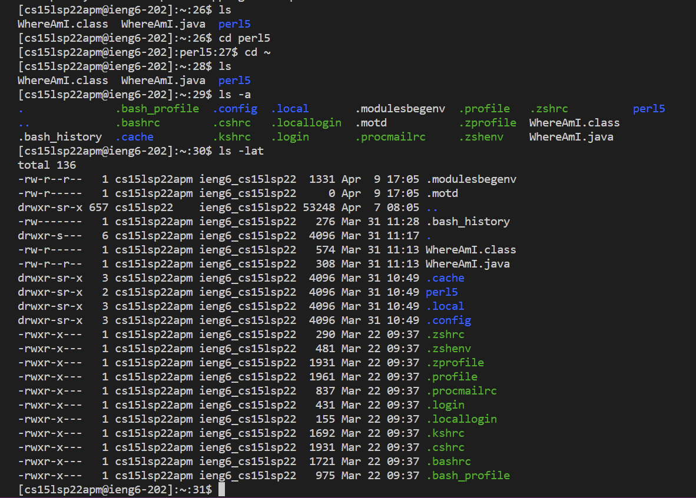

# Week 2 Lab Report 1
## *1.Installing VSCode*

    Press the download button to download VSCode.

    After downloading and installing, you should see this window when you open it up.

---

## *2.Remote Connecting*
If you are using a windows based computer, you should download OpenSSH first. Instruction is here: [Install OpenSSH](https://docs.microsoft.com/en-us/windows-server/administration/openssh/openssh_install_firstuse)

Then you need to open up VSCode and open a terminal, so you can connect to the server. After logging in, the terminal should look like this...

---

## *3. Run some commands*
Now, we should try out some commands on our terminal. Run cd, ls, pwd, mkdir, cp in different ways.

---

## *4. Moving files with scp*