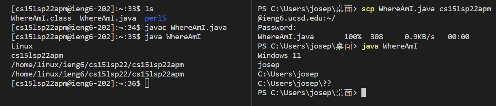
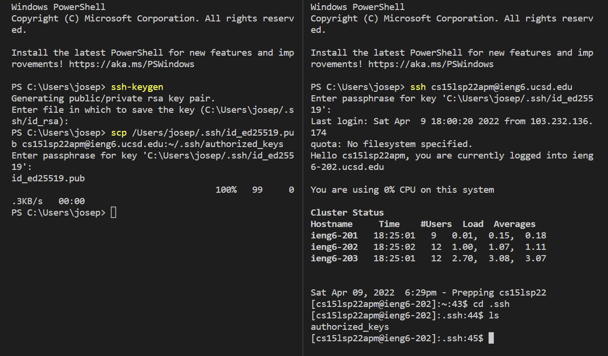
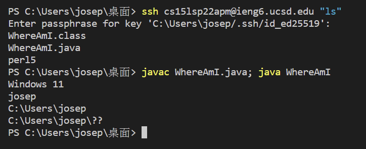

# Week 2 Lab Report 1
## *1.Installing VSCode*

    Press the download button to download VSCode.

    After downloading and installing, you should see this window when you open it up.

---

## *2.Remote Connecting*
If you are using a windows based computer, you should download OpenSSH first. Instruction is here: [Install OpenSSH](https://docs.microsoft.com/en-us/windows-server/administration/openssh/openssh_install_firstuse)

Then you need to open up VSCode and open a terminal, so you can connect to the server. After logging in, the terminal should look like this...

---

## *3. Run some commands*
Now, we should try out some commands on our terminal. Run cd, ls, pwd, mkdir, cp in different ways.

---

## *4. Moving files with scp*
Now, we will try to copy a file from our computer to the server remotely. By using the command: scp. We can achieve that. The result is shown in the image below. Where we can compile and run our program on the server too.

---

## *5. Setting up ssh key*
By using ssh key, we don't need to type in our password everytime we do ssh or scp. We should first enter `ssh-keygen` on our local terminal. This create a pair of files: public key and private key. We need to first create a folder: `.ssh` on the server. And we will copy the public key file into .ssh on server using `scp`.

After that, we should be able to use ssh and scp without typing in our password.

---

## *6. Optimizing remote running*
There are some tricks when writing commands that can make our remote access experience more pleasant.

As show in the image, we can write a command in quotes at the end of an ssh command to directly run it on the remote server. We can also use semicolon separating individual commands to run several commands in one line.
And, pressing `UP` key can recall the previous command ran.