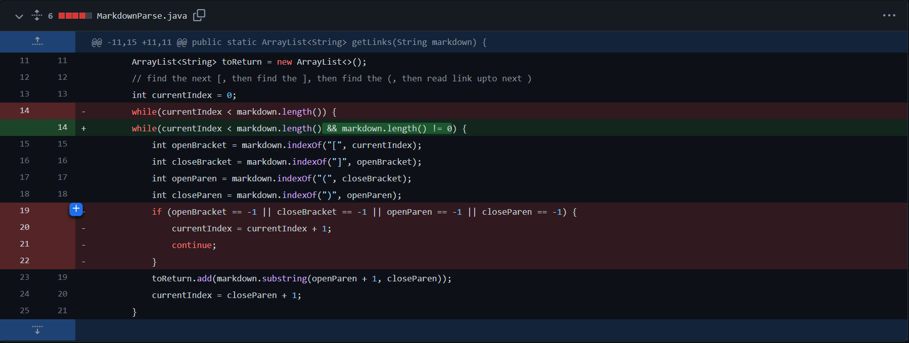
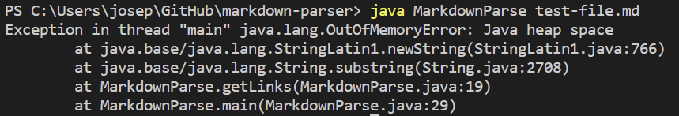

# Week 4 Lab Report 2
## ***1. Change One***

The above shows the first change to MarkdownParse.java.

[This is the link to the test file I use for this change in MarkdownParse.java](https://github.com/yeh0903/markdown-parser/blob/54edd708e9da81ef3dac6e86cc5b693c21b0d66f/test-file.md)

The above shows the symptom I encountered when I tried to run my code in terminal.

The change I made here doesn't help at all to the bug because the length of the input string will never be 0. The bug here is that when the program did not find `closeParen` in the string, it will return -1 (storing it in `closeParen`). The current index will then be 0, and the program will go into infinite loop, causing the symptom of system running out of memory.

---

## ***2. Change Two***
