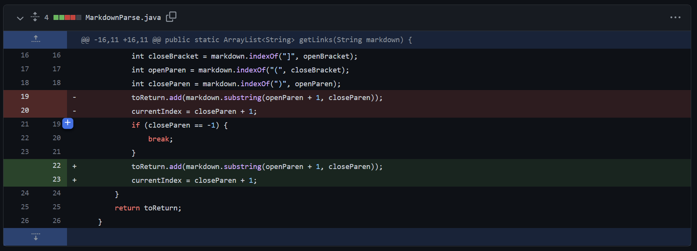
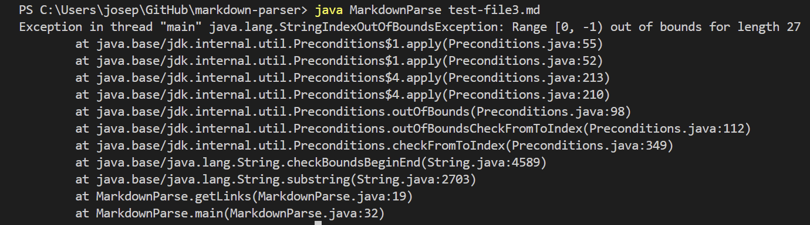
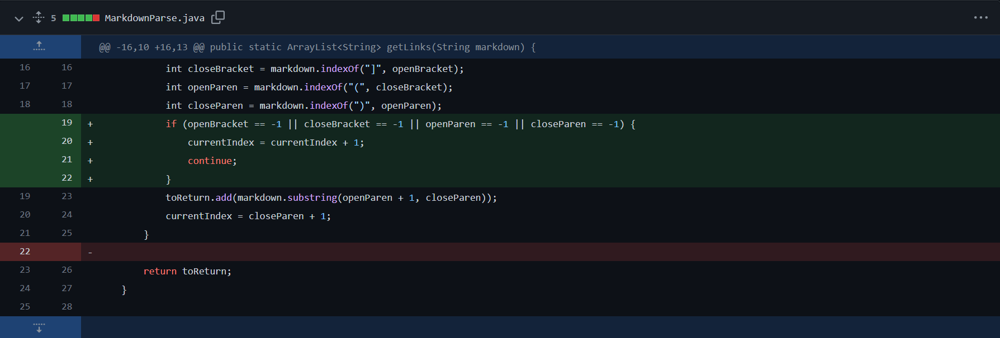
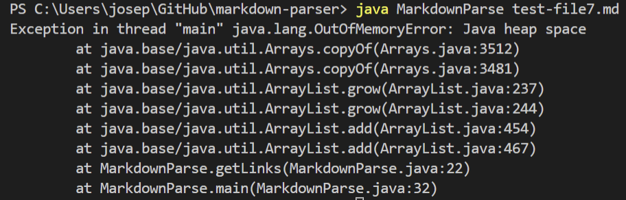

# Week 4 Lab Report 2
## ***1. Change One***

The above shows the first change to MarkdownParse.java.

[This is the link to the test file I use for this change in MarkdownParse.java](https://github.com/yeh0903/markdown-parser/blob/54edd708e9da81ef3dac6e86cc5b693c21b0d66f/test-file.md)

The above shows the symptom I encountered when I tried to run my code in terminal.

The change I made here doesn't help at all to the bug because the length of the input string will never be 0. The bug here is that when the program did not find `closeParen` in the string, it will return -1 (storing it in `closeParen`). The current index will then be 0, and the program will go into infinite loop, causing the symptom of system running out of memory.

---

## ***2. Change Two***

The above shows the second change to MarkdownParse.java.

[This is the link to the test file I use for this change in MarkdownParse.java.](https://github.com/yeh0903/markdown-parser/blob/main/test-file3.md)

The above shows the symptom I encountered when I tried to run my code in terminal.

The bug here is that when the program did not find `closeParen` in the string, it will return -1 (storing it in `closeParen`). And when the substring is passed with the value -1, it will throw an indexoutofbound exception.

---

## ***3. Change Three***

The above shows the third change to MarkdownParse.java.

[This is the link to the test file I use for this change in MarkdownParse.java.](https://github.com/yeh0903/markdown-parser/blob/main/test-file7.md)

The bug in here was that when the program did not find `openParen` in the string, it will return -1 (storing it in `openParen`). The program cannot find an openParen to grab the content, and the program will be keep looking for the openParen infinitely. So, the program will go into infinite loop, causing the symptom of system running out of memory. My conditional statement added now can prevent this from happening. My code recognize if any of the bracket or parentheses are not found, then I will strictly increase the currrent index by 1 and continue the loop. This can prevent the code from crashing into infinite loop.