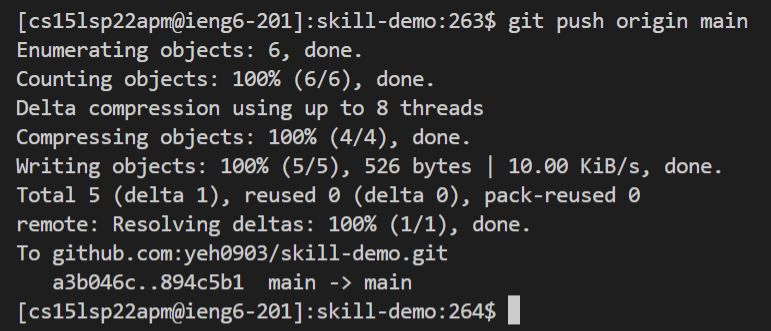

# Week 6 Lab Report 3
## ***1. Streamlining ssh Configuration***

The picture above shows my .ssh/config file and I am using VSCode to edit it.

The picture above shows that I log onto ieng6 with the new config file.

The picture above is showing I copied my file using scp to ieng6 account.

---

## ***2. Setup Github Access from ieng6***

The above photo shows that my `public key: id_rsa_github.pub` and `private key: id_rsa_github` are stored in the .ssh file on ieng6.

The picture above shows that my public ssh key has been added to my github account.

The picture above shows that I successfully commit and push changes to my github repository using ieng6 account.

[This is the link to the commit I made using ieng6 account.](https://github.com/yeh0903/skill-demo/commits/main/report.java)

---

## ***3. Copy whole directories with scp -r***

The above images show I executing scp -r locally to copy my entire markdown-parse directory to the ieng6 account.

The image above shows that I logged into my ieng6 account, and I compiled and ran my tests for my repository.

The images above show that I run scp, ssh, and tests on the repository in one line at the terminal.