# Week 6 Lab Report 3
## ***1. My Own Markdown-parse Repository***

[This is the link to my own markdown-parse repository](https://github.com/yeh0903/markdown-parser)

### **First Test** ###

**Expected output:** [`google.com, google.com, ucsd.edu]

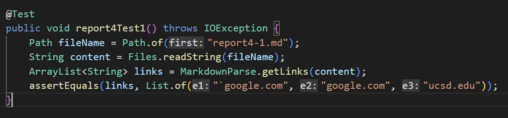
The above is my JUnit test for the first markdown snippet.

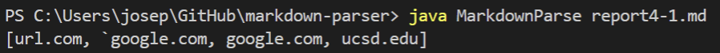
The above is the produced output from my program in the terminal.

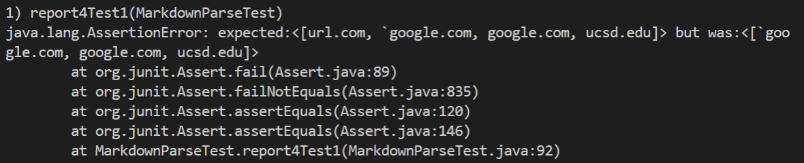
The above shows the failure in my JUnit test, indicating produced output isn't same as expected.

---

### **Second Test** ###

**Expected output:** [a.com, a.com(()), example.com]

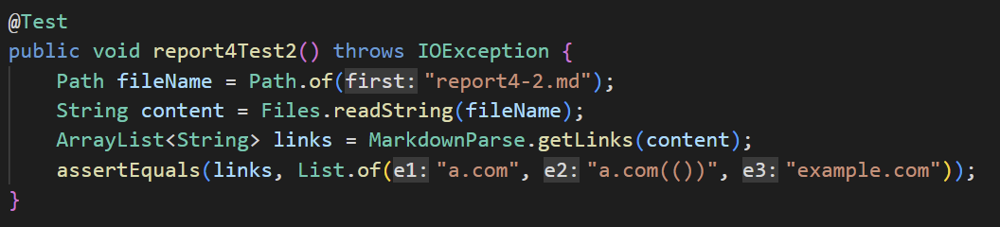
The above is my JUnit test for the second markdown snippet.

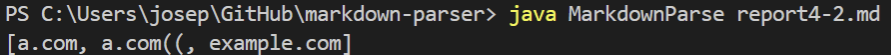
The above is the produced output from my program in the terminal.

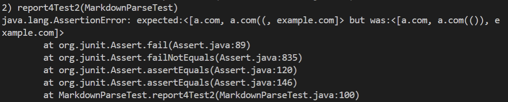
The above shows the failure in my JUnit test, indicating produced output isn't same as expected.

---

### **Third Test** ###

**Expected output:** [https://sites.google.com/eng.ucsd.edu/cse-15l-spring-2022/schedule]

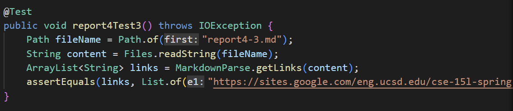
The above is my JUnit test for the third markdown snippet.

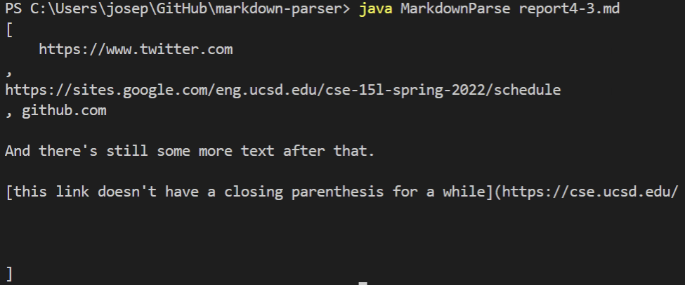
The above is the produced output from my program in the terminal.

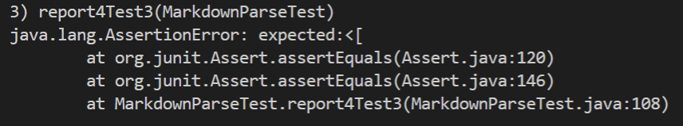
The above shows the failure in my JUnit test, indicating produced output isn't same as expected.

---
---

## ***2. Markdown-parse Repository from Week 7***

[This is the link to the markdown-parse repository we reviewed in week 7](https://github.com/Miyuki-L/markdown-parser)

### **First Test** ###

**Expected output:** [`google.com, google.com, ucsd.edu]

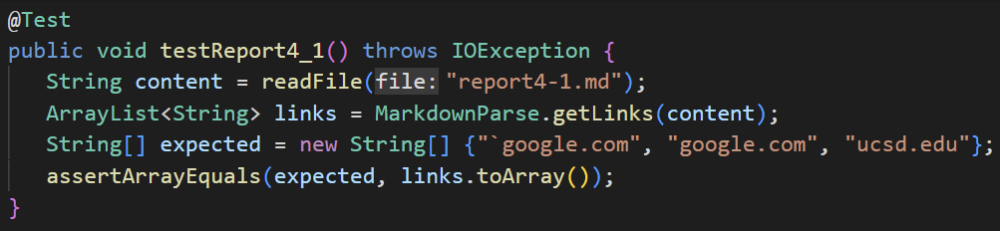
The above is the JUnit test for the first markdown snippet.

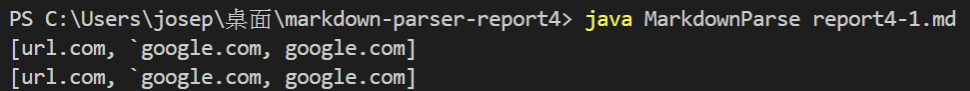
The above is the produced output from her program in the terminal.

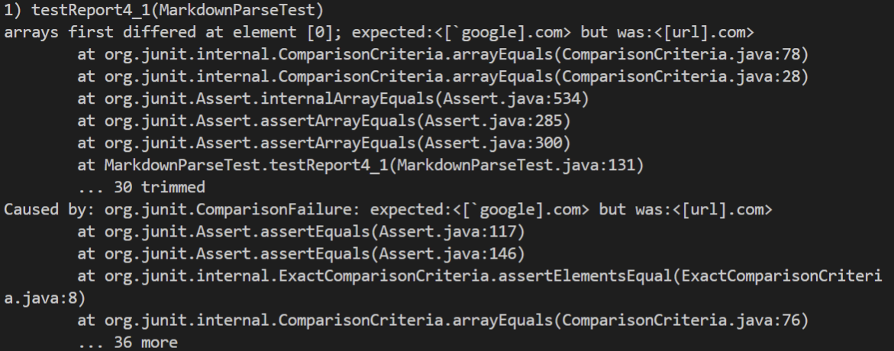
The above shows the failure in her JUnit test, indicating produced output isn't same as expected.

---

### **Second Test** ###

**Expected output:** [a.com, a.com(()), example.com]

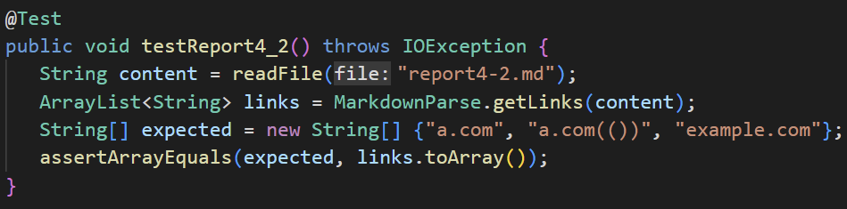
The above is the JUnit test for the second markdown snippet.

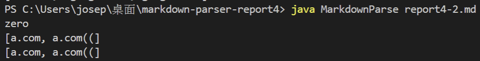
The above is the produced output from her program in the terminal.

The above shows the failure in her JUnit test, indicating produced output isn't same as expected.

---

### **Third Test** ###

**Expected output:** [https://sites.google.com/eng.ucsd.edu/cse-15l-spring-2022/schedule]

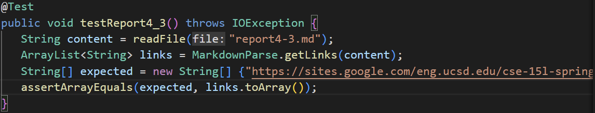
The above is the JUnit test for the third markdown snippet.

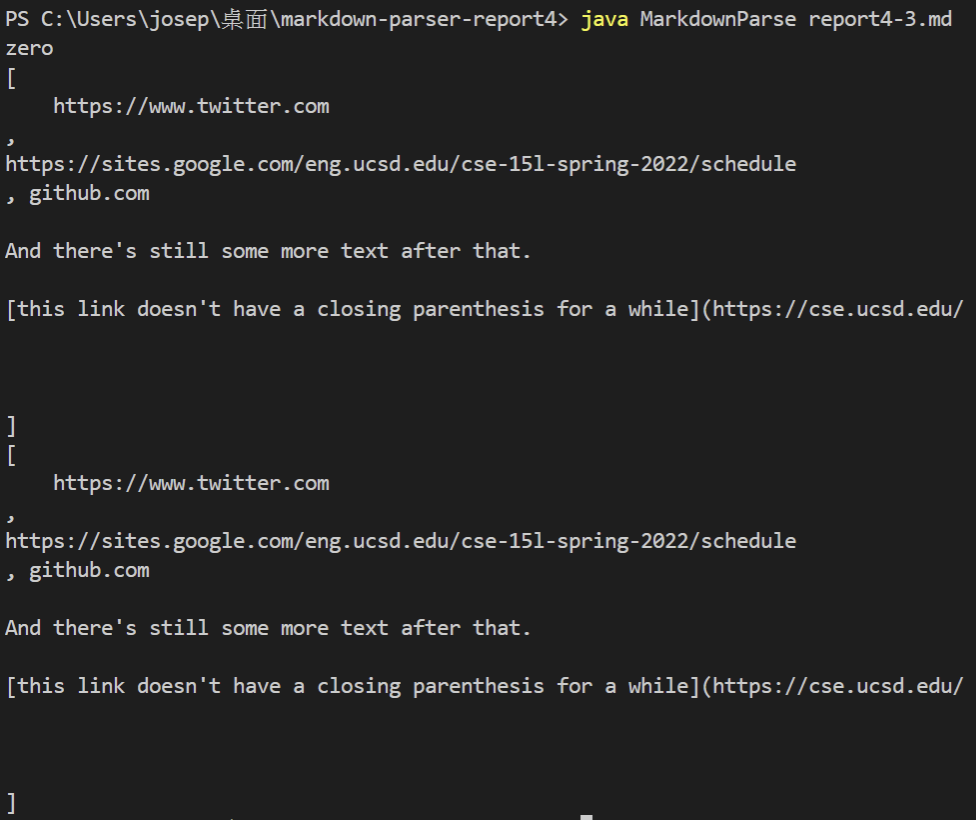
The above is the produced output from her program in the terminal.

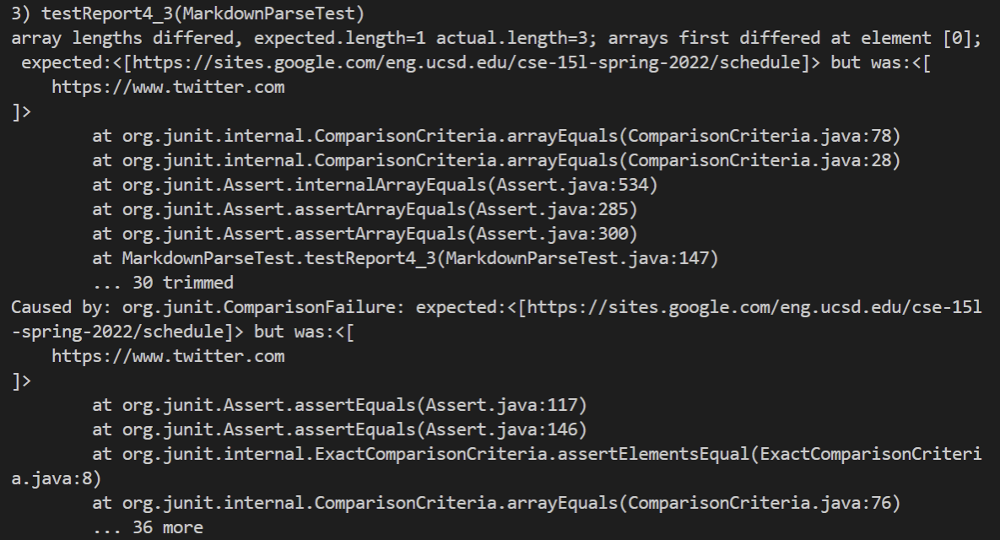
The above shows the failure in her JUnit test, indicating produced output isn't same as expected.

---

## ***3. Answer to Questions***

### **Snippet One** ###

For code snippet one, I 