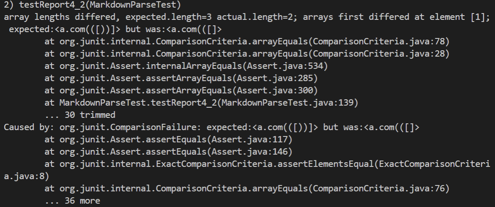

# Week 8 Lab Report 4
## ***1. My Own Markdown-parse Repository***

[This is the link to my own markdown-parse repository](https://github.com/yeh0903/markdown-parser)

### **First Test** ###

**Expected output:** [`google.com, google.com, ucsd.edu]

The above is my JUnit test for the first markdown snippet.

The above is the produced output from my program in the terminal.

The above shows the failure in my JUnit test, indicating produced output isn't same as expected.

---

### **Second Test** ###

**Expected output:** [a.com, a.com(()), example.com]

The above is my JUnit test for the second markdown snippet.

The above is the produced output from my program in the terminal.

The above shows the failure in my JUnit test, indicating produced output isn't same as expected.

---

### **Third Test** ###

**Expected output:** [https://sites.google.com/eng.ucsd.edu/cse-15l-spring-2022/schedule]

The above is my JUnit test for the third markdown snippet.

The above is the produced output from my program in the terminal.

The above shows the failure in my JUnit test, indicating produced output isn't same as expected.

---
---

## ***2. Markdown-parse Repository from Week 7***

[This is the link to the markdown-parse repository we reviewed in week 7](https://github.com/Miyuki-L/markdown-parser)

### **First Test** ###

**Expected output:** [`google.com, google.com, ucsd.edu]

The above is the JUnit test for the first markdown snippet.

The above is the produced output from her program in the terminal.

The above shows the failure in her JUnit test, indicating produced output isn't same as expected.

---

### **Second Test** ###

**Expected output:** [a.com, a.com(()), example.com]

The above is the JUnit test for the second markdown snippet.

The above is the produced output from her program in the terminal.

The above shows the failure in her JUnit test, indicating produced output isn't same as expected.

---

### **Third Test** ###

**Expected output:** [https://sites.google.com/eng.ucsd.edu/cse-15l-spring-2022/schedule]

The above is the JUnit test for the third markdown snippet.

The above is the produced output from her program in the terminal.

The above shows the failure in her JUnit test, indicating produced output isn't same as expected.

---

## ***3. Answer to Questions***

### **Snippet One** ###

For code snippet one, I think 10> of codes can fix the problem. My program's problem in this case is that it didn't recogzie the ` in the file. So if I can add an if statement to recognize an pair of ' appears before the last bracket, and prevent the code from assuming it is a valid link.

### **Snippet Two** ###

For code snippet two, I think a 10> lines of code change can fix the problem. I can add a while loop to catch the last close parentheses without encoutering any spaces or /n. And then I can successfully catch everything in the link.

### **Snippet Three** ###

For code snippet three, I think a 10> lines of code change can fix the problem. To recognize the close parentheses in a link, we should add a loop and if statements allow up to only one /n and no other characters between the content of the link and ). So then we can succesfully recognize all links in the test file.