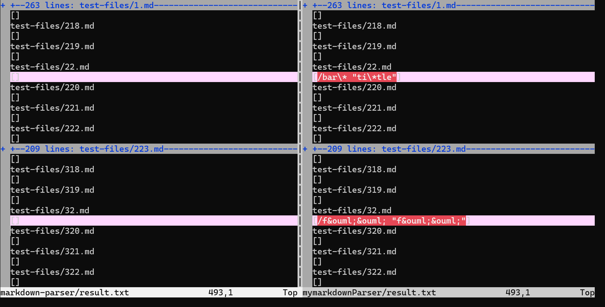
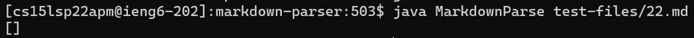
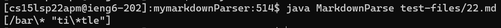
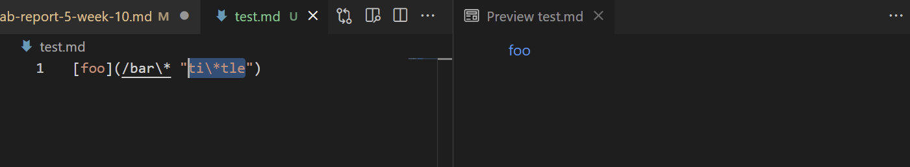
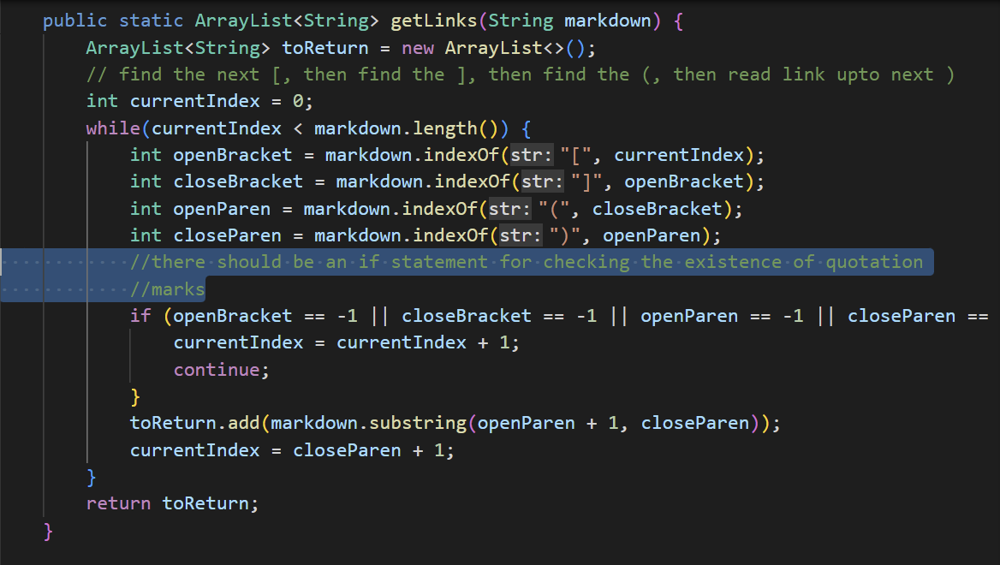
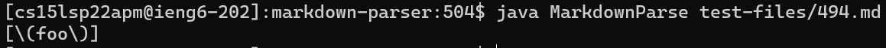
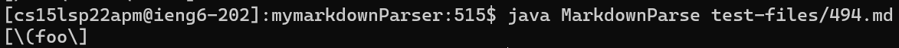
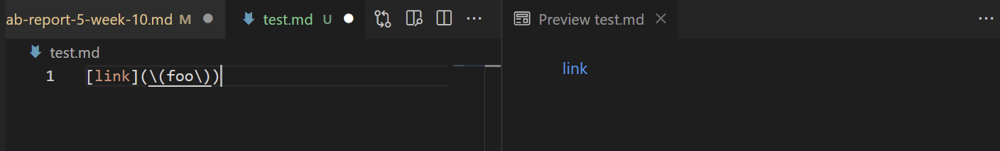
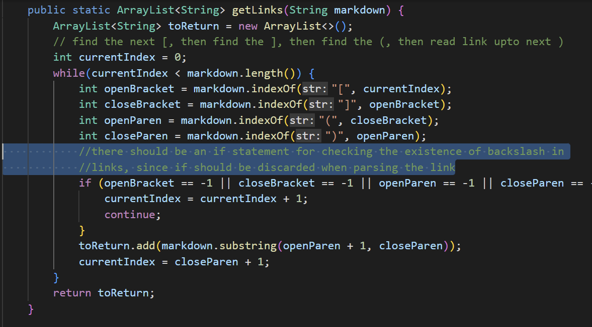

# Week 10 Lab Report 5
For the test results, I used vimdiff to visualize the difference in outputs between the lab-9 version and my implementation.

## ***1. First Test File***
[This is the link to the first test file](https://github.com/nidhidhamnani/markdown-parser/blob/main/test-files/22.md)

This is the output from the lab9 implementation of markdown-parser.

This is the output from my implementation of markdown-parser

The expected output of the 22.md should be: **[ti\*tle]**.

So both implementation provided incorrect outputs.

The bug here in my program is that my program only recognizes brakcets and parentheses for parsing links. And in this test case, it contains " marks that my program couldn't recognize and parse the link correctly.

The following is the picture highlighting the change to be made in the program.

---

## ***2. Second Test File***
[This is the link to the second test file](https://github.com/nidhidhamnani/markdown-parser/blob/main/test-files/494.md)

This is the output from the lab9 implementation of markdown-parser.

This is the output from my implementation of markdown-parser

The expected output of the 494.md should be: **[(foo)]**.

So both implementation in this case fail to produce the correct output.

The bug here in my program is that my markdownParse file do not have the ability to exclude the backslash \ in the link since it only recognize brackets and parentheses.

The following is the picture highlighting the change to be made in the program.
